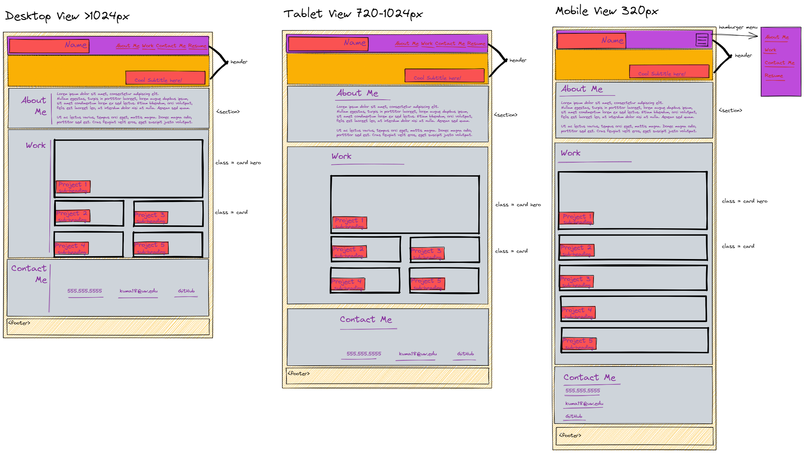
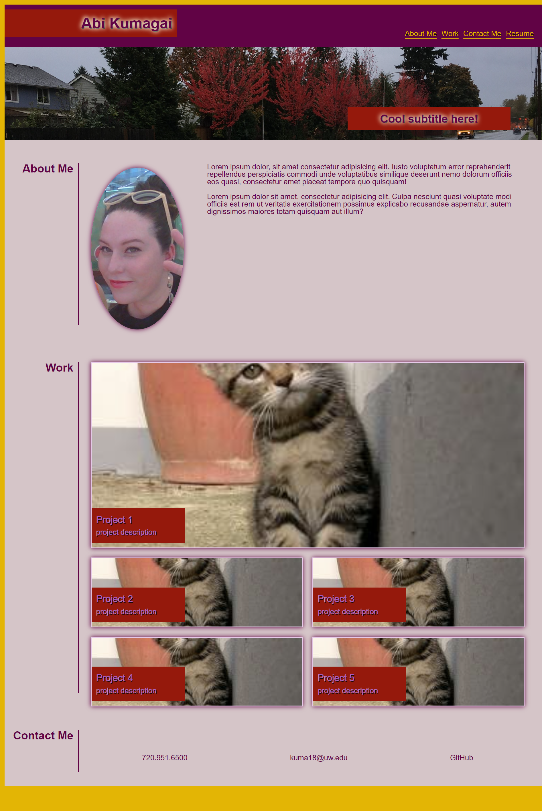
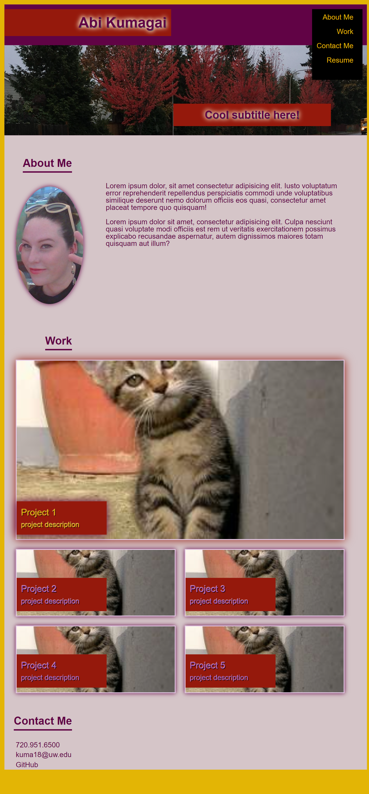
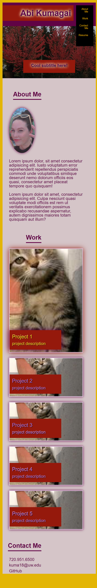

# Professional Portfolio

## Description

A portfolio to showcase my projects and skills that I cultivate during the UW Coding Bootcamp. I use a wireframe to plan out my website design. Currently this shows my use of HTML and CSS to create the framework of a webpage. I have a strong interest in front-end design. This represents 20+ hours of work pushing the boundaries of my knowledge to attempt more advanced CSS styling to create an aesthetic and responsive website.

## Installation

N/A

## Usage

Showcase my projects.

 

### Wireframe

 

### Screenshot Desktop View

 

### Screenshot Tablet View

 

### Screenshot Mobile View

 

## Credits

Tutor: Doug Kumagai:
https://www.linkedin.com/in/doug-kumagai/
https://github.com/ndesmic

Color Palette Generator: https://coolors.co/

mdn web docs: https://developer.mozilla.org/en-US/

A Complete Guide to Flexbox: https://css-tricks.com/snippets/css/a-guide-to-flexbox/#top-of-site

css-to-desaturate-background-image: https://stackoverflow.com/questions/27572728/css-to-desaturate-background-image-only-with-other-images-in-div-stay-saturated

## License

Please refer to the LICENSE in the repo.